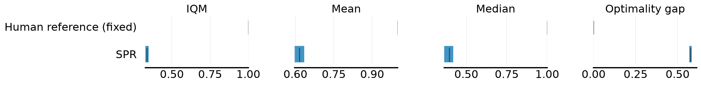
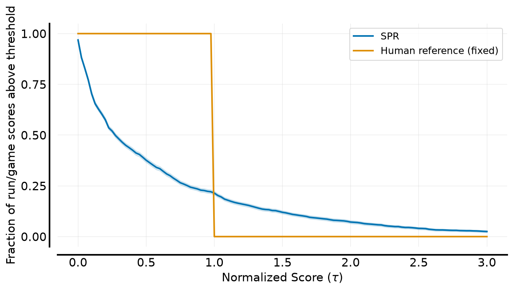
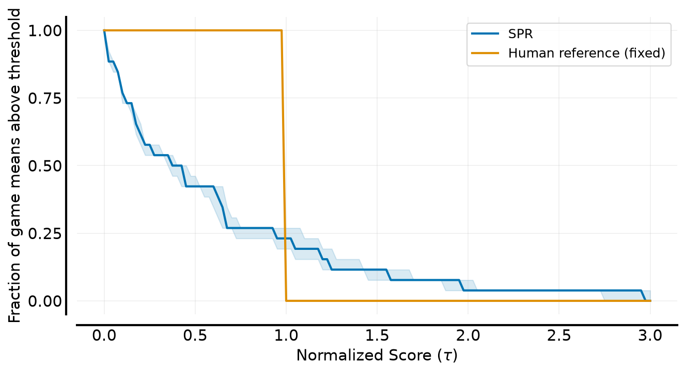
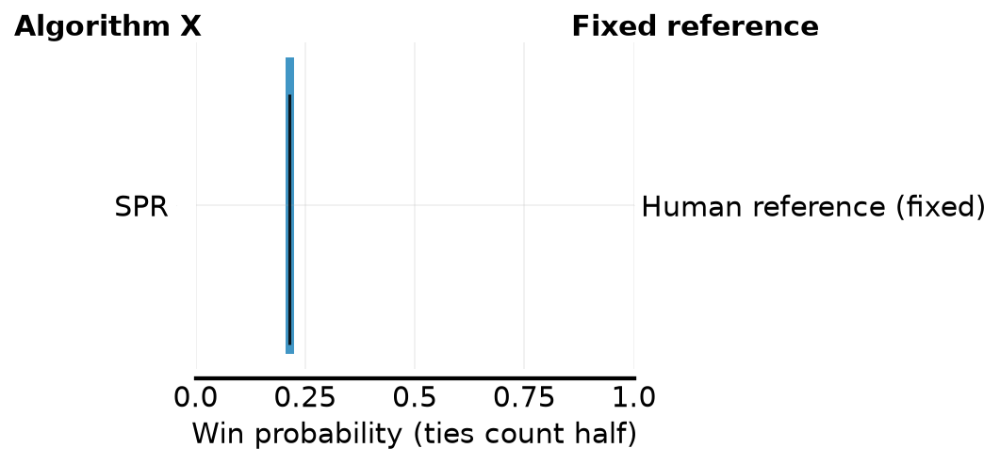

# Published Atari scores: SPR versus a fixed human reference

This example runs Ferrograd on 100 published SPR runs for each of 26 Atari
100k games. It checks all three public APIs, both profile definitions, and
aggregate intervals with and without task resampling. No agents are trained.

Scores are normalized per game as `(score - random) / (human - random)`.
Zero denotes the published random reference and one the published human
reference. See [data provenance](../../benchmarks/README.md#published-data-provenance)
for sources, hashes, and preprocessing. The raw files are already in the repo;
this example requires no data download.

## Results

Seed 7, 2,000 bootstrap repetitions, nominal 95% percentile intervals,
one thread, and optimality-gap threshold 1:

| SPR statistic | Estimate | Interval, fixed game set | Interval, resampled games |
|---|---:|---:|---:|
| IQM | 0.3366 | [0.3259, 0.3481] | [0.1727, 0.6025] |
| Mean | 0.6158 | [0.5972, 0.6346] | [0.3769, 0.9050] |
| Median of game means | 0.3956 | [0.3629, 0.4185] | [0.1608, 0.6675] |
| Optimality gap | 0.5773 | [0.5702, 0.5843] | [0.4434, 0.7021] |

The mean exceeds the IQM: high scores on some games raise the mean.
Resampling games produces much wider intervals here. Fixed-game intervals
measure run uncertainty on these 26 games; task bootstrap also reflects
variation from resampling the game set. It does not establish performance
on every possible game.

SPR's improvement probability against the fixed human reference is **0.2142**
with interval **[0.2054, 0.2238]**, averaging equally over games and awarding
half-credit for ties. This is comparison with one published reference value
per game, not a sampled population of human players. Human-reference
uncertainty is unavailable and is not included. Its degenerate intervals
in the plots follow from treating those values as constants.

Profile bands are pointwise percentile intervals, not simultaneous confidence
bands for the entire curve. The displayed threshold range is 0–3; scores
outside this range are still included in every calculation. Nominal 95%
intervals do not guarantee 95% empirical coverage; see the
[coverage sanity check](../../benchmarks/PACKAGE_REPORT.md#scope-and-verification).

## Plots

Aggregate intervals below hold the game set fixed. Higher is better for
IQM, mean, and median; lower is better for optimality gap.









## Reproduce and verify

With Ferrograd installed in the pinned Python 3.12 reference environment:

```sh
.venv-reference/bin/python examples/atari_analysis.py
```

The script independently checks point estimates against NumPy and rliable,
checks finite ordered interval bounds, and verifies normalization against the
stored benchmark matrix. It writes [results.json](results.json) and four
plots here. JSON includes input hashes, game order, bootstrap settings,
full profile values, and interval endpoints.

The real-data run exposed presentation issues in the plotting defaults:
cramped metric labels, absent profile legends, an incorrect label for
profiles of game means, and a tightly zoomed probability axis. The example
sets explicit spacing, labels, legends, and a 0–1 probability axis. No
numerical API change was needed for this dataset.
